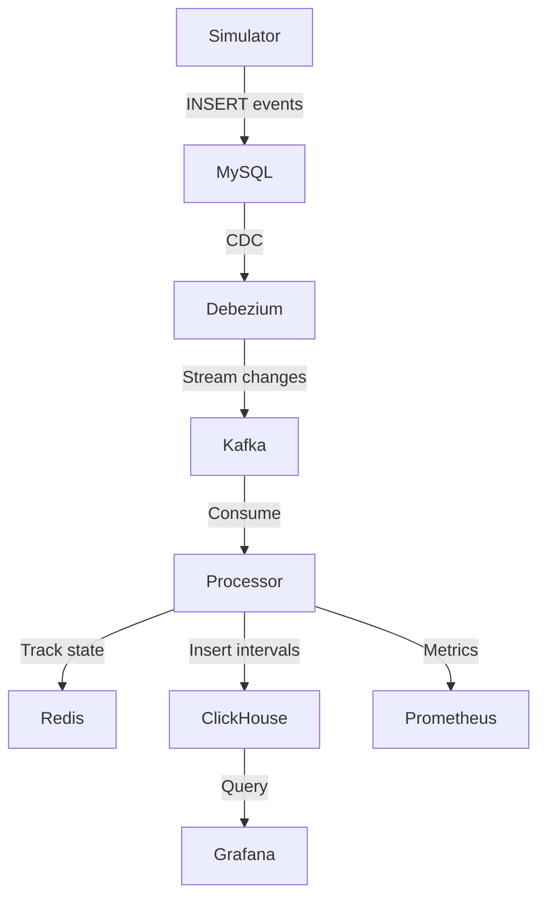
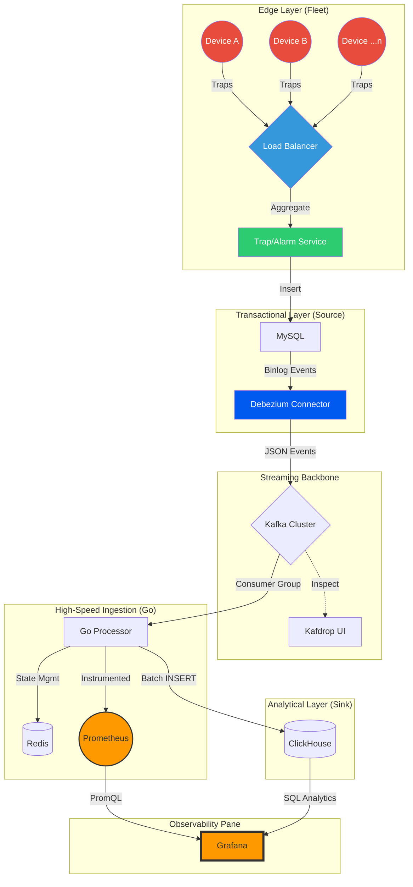

# GoCDC: Real-Time Network Availability Engine

A high-performance, scalable observability pipeline for real-time network monitoring and availability tracking. Built with Go, this system simulates network events, captures changes via CDC (Change Data Capture), processes them in real-time, and provides analytics through ClickHouse with monitoring via Prometheus and Grafana.

## 🚀 Features

- **High-Throughput Simulation**: Generates synthetic UP/DOWN events for up to 15,000 network nodes at thousands of events per second.
- **Real-Time CDC**: Uses Debezium to capture MySQL changes and stream them to Kafka without polling.
- **Stateful Processing**: Tracks node states in Redis for accurate uptime calculations.
- **Analytical Storage**: Stores downtime intervals in ClickHouse for fast queries and SLA reporting.
- **Comprehensive Monitoring**: Integrated Prometheus metrics and Grafana dashboards for observability.
- **Scalable Architecture**: Parallel workers, batching, and optimized for high concurrency.

## 🏗️ Architecture



### Components

1. **Simulator (Go)**: Generates random UP/DOWN events into MySQL's `histalarms` table.
2. **Debezium**: Captures row changes from MySQL and publishes to Kafka topics.
3. **Processor (Go)**: Consumes Kafka messages, maintains node states in Redis, calculates downtime intervals, and batches inserts into ClickHouse.
4. **ClickHouse**: OLAP database storing intervals with materialized views for daily stats and SLA calculations.
5. **Monitoring Stack**: Prometheus collects metrics from the processor; Grafana visualizes data and SLAs.

## 📋 Prerequisites

- Docker & Docker Compose
- Go 1.21+ (for local development)
- At least 8GB RAM (for Docker services)

## 🛠️ Quick Start

### 1. Clone and Navigate
```bash
git clone https://github.com/ShivamYadav0/gocdc.git
cd gocdc
```

### 2. Start Infrastructure
```bash
docker-compose up -d
```

This starts all services: MySQL, Kafka, Debezium, Redis, ClickHouse, Prometheus, Grafana.

### 3. Configure Debezium Connector
```bash
curl -i -X POST -H "Accept:application/json" -H "Content-Type:application/json" \
localhost:8083/connectors/ -d '{
  "name": "mysql-connector",
  "config": {
    "connector.class": "io.debezium.connector.mysql.MySqlConnector",
    "database.hostname": "mysql",
    "database.port": "3306",
    "database.user": "root",
    "database.password": "debezium",
    "database.server.id": "184054",
    "topic.prefix": "dbserver1",
    "database.include.list": "inventory",
    "schema.history.internal.kafka.bootstrap.servers": "kafka:9092",
    "schema.history.internal.kafka.topic": "schema-changes.inventory",
    "schema.history.internal.kafka.recovery.poll.interval.ms": "5000",
    "schema.history.internal.replication.factor": "1",
    "topic.creation.default.replication.factor": "1",
    "topic.creation.default.partitions": "1"
  }
}'
```

### 4. Run the Simulator
```bash
go run simulator/main.go
```

### 5. Run the Processor
```bash
go run procesor/main.go
```

### 6. View Dashboards
- **Grafana**: http://localhost:3000 (admin/admin)
- **Prometheus**: http://localhost:9090
- **Kafdrop**: http://localhost:9001 (Kafka UI)

## 📊 Usage

### Monitoring Events
Check Debezium logs for CDC activity:
```bash
docker logs -f debezium
```

### Querying Data
Connect to ClickHouse:
```bash
docker exec -it clickhouse clickhouse-client
```

Sample queries:
```sql
-- View recent intervals
SELECT * FROM node_intervals ORDER BY down_at DESC LIMIT 10;

-- SLA report for today
SELECT * FROM node_sla_report WHERE day = today();
```

### Metrics
Processor exposes Prometheus metrics at `http://localhost:2112/metrics` (configurable).

## ⚙️ Configuration

### Environment Variables
- `KAFKA_BROKER`: Kafka broker address (default: localhost:9093)
- `REDIS_ADDR`: Redis address (default: localhost:6379)
- `CLICKHOUSE_ADDR`: ClickHouse address (default: localhost:9000)
- `WORKER_COUNT`: Number of parallel workers (default: 20)
- `BATCH_SIZE`: ClickHouse batch size (default: 2000)

### Scaling
- Increase `ConcurrentWorkers` in simulator for higher load.
- Adjust `WorkerCount` and `BatchSize` in processor for throughput.
- Scale Kafka partitions and ClickHouse shards for production.

## 🧪 Development

### Building
```bash
go mod tidy
go build -o bin/simulator simulator/main.go
go build -o bin/processor procesor/main.go
```

### Testing
```bash
go test ./...
```

### Code Structure
- `simulator/`: Event generation logic
- `procesor/`: Kafka consumer and processing
- `utils/`: Configuration files for monitoring
- `grafana/`: Setup scripts for dashboards
- `init-db/`: Database schemas

## 🤝 Contributing

1. Fork the repository
2. Create a feature branch
3. Make changes with tests
4. Submit a pull request

## Acknowledgments

- Debezium for CDC capabilities
- ClickHouse for fast analytics
- Prometheus & Grafana for monitoring



